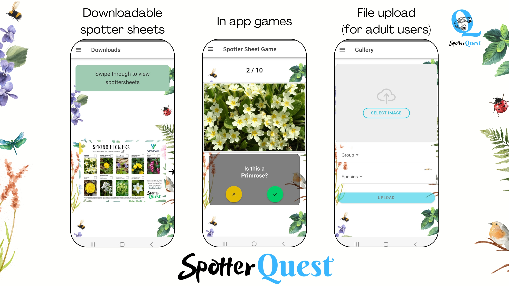

# SpotterQuest
A citizen Science biodiversity project.

SpotterQuest is aimed at engaging individuals in the vital task of wildlife observation and analysis. This project aims to empower schoolchildren and lay audiences  to contribute to scientific research by capturing and documenting images of various species in their habitats.
Central to SpotterQuest is a user-friendly app, through which participants can upload their photographs, providing valuable data for species monitoring and conservation initiatives, as well as building a labeled image database to be used in the future in image-led biodiversity analysis.

